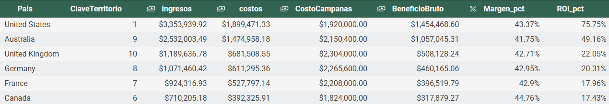

# Sales & Marketing ROI Analysis


Análisis de desempeño de ventas y retorno de inversión (ROI) de campañas de marketing por país, desarrollado en SQL.

## 📋 Descripción

Este repositorio contiene el análisis de desempeño de ventas y el retorno de inversión (ROI) de las campañas de marketing por país de una empresa retail de productos outdoor.

El objetivo fue tomar los datos de ventas, productos y campañas de marketing para calcular el **beneficio bruto** y el **ROI** por territorio, además de validar la integridad y calidad de los datos utilizados.

Se utilizaron las siguientes tablas: `campanas`, `productos`, `productos_categorias`, `ventas_2017`, `territorios`, `pais_ingreso_costo` y `pais_campanas`, con información de ventas, catálogo de productos, categorías, territorios geográficos e inversión en campañas.

## 🛠 Tech Stack

- **SQL (PostgreSQL)** — consultas, joins y agregaciones
- **Funciones utilizadas:** `COALESCE`, `NULLIF`, `CAST`, agregaciones (`SUM`), `GROUP BY`, `LEFT JOIN`

## 📁 Estructura del repositorio

```
sales-marketing-roi-analysis/
├── README.md
├── data/
│   └── raw/                  # CSVs originales (ventas, productos, territorios, campañas)
├── queries/
│   └── S9_Sales_Marketing_ROI.sql
```

## 📊 Diccionario de datos

| Tabla | Descripción |
|---|---|
| `ventas_2017` | Registro de pedidos: número de pedido, producto, cantidad y territorio |
| `productos` | Catálogo de productos con precio y costo unitario |
| `productos_categorias` | Categorías y subcategorías de productos |
| `territorios` | País, continente y clave de territorio |
| `campanas` | Campañas de marketing y su costo |
| `pais_ingreso_costo` | Ingresos y costos agregados por país/territorio |
| `pais_campanas` | Costo de campañas agregado por país/territorio |

## ▶ Cómo ejecutar el análisis

1. Crea una base de datos PostgreSQL y carga los CSV de `data/raw/` en las tablas correspondientes.
2. Abre `queries/S9_Sales_Marketing_ROI.sql` en tu cliente SQL preferido.
3. Ejecuta las consultas en el orden en que aparecen, ya que las secciones posteriores dependen de las tablas/vistas generadas en secciones previas (`pais_ingreso_costo`, `pais_campanas`).

## 🔎 Estructura de las queries

1. **Visualización de tablas** — exploración inicial de `campanas`, `productos`, `productos_categorias` y `ventas_2017`.
2. **Columnas calculadas** — cálculo de `ingreso_total` y `costo_total` por producto vendido, uniendo `ventas_2017` con `productos`, `productos_categorias` y `territorios`.
3. **Cálculo de ROI** — agregación de ingresos, costos y costo de campañas por país/territorio, con cálculo de beneficio bruto, margen (%) y ROI (%).
4. **Validación de integridad** — verificación de valores nulos en `numero_pedido`, `clave_producto` y `clave_territorio`, cantidades no válidas (≤ 0) en `ventas_2017`, y precios negativos en `productos`.

## 🔑 Resultados clave

Se construyó una vista consolidada por pedido que combina ventas, productos, categorías y territorios, habilitando el cálculo de `ingreso_total` y `costo_total` a nivel de línea de pedido. El cálculo de ROI y margen por país permite identificar qué territorios generan mayor retorno respecto a su inversión en campañas de marketing. Las validaciones de integridad no arrojaron valores nulos en las claves principales de `ventas_2017`; se identificaron registros con cantidades y/o precios inválidos que deben tratarse antes de un análisis más profundo.



1. 🇺🇸 **Estados Unidos** es el país con mayores ingresos, sin la necesidad de ser la región en la cual se invierte más en publicidad.
2. 🇨🇦 Si bien **Canadá** es la región que aporta menos ingresos, este mismo territorio se coloca con el mejor margen bruto.
3. 🇺🇸 **Estados Unidos** resalta de nuevo por conseguir el mayor retorno sobre la inversión en marketing.

## ⚠️ Limitaciones

- El cálculo de ROI depende de la disponibilidad de datos en `pais_campanas`; los países sin campañas registradas se reportan con `costo_campana` en 0 mediante `COALESCE`.
- Las validaciones de integridad identifican valores nulos e inválidos, pero no corrigen automáticamente los registros afectados.

## 🚀 Próximos pasos

- [ ] Definir y aplicar un tratamiento para los registros con valores inválidos identificados (cantidades ≤ 0, precios negativos).
- [ ] Profundizar el análisis de ROI por categoría de producto además de por país/territorio.
